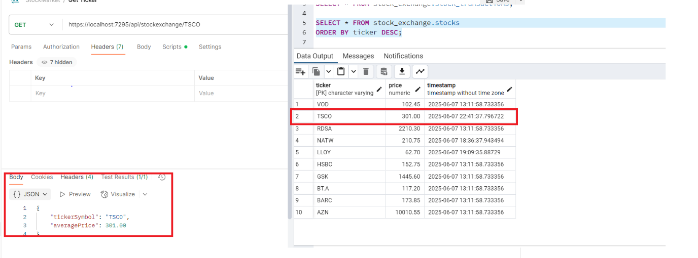
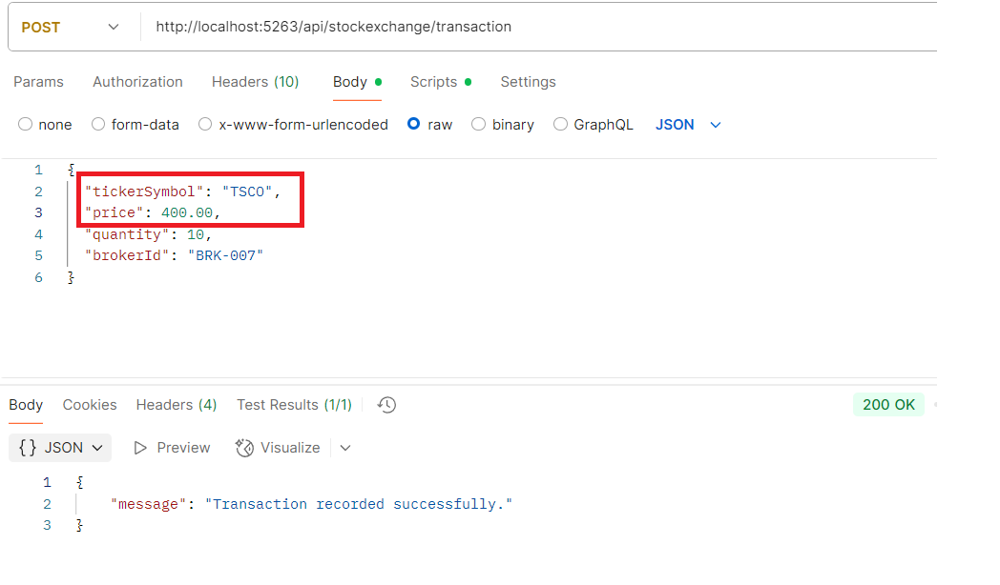
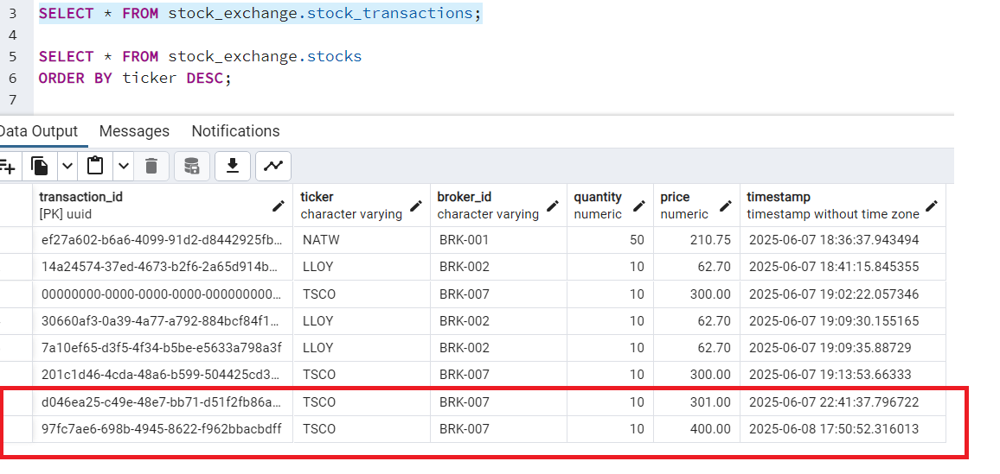
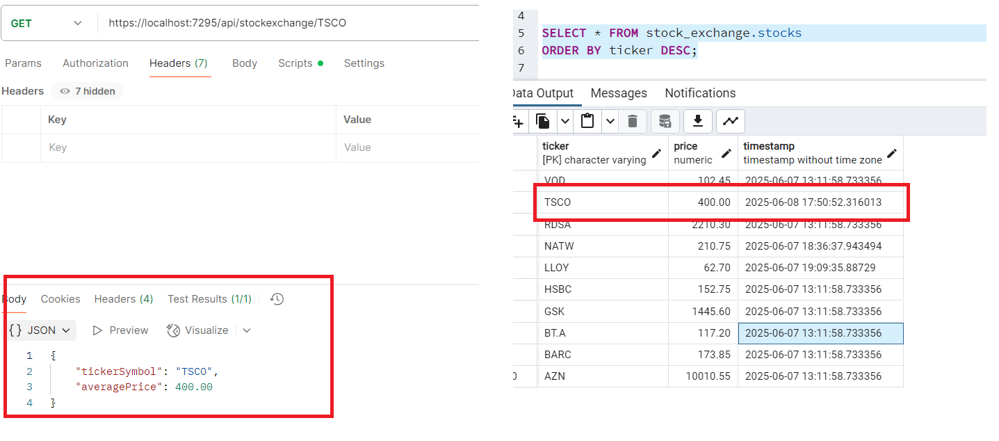

**Solution Overview**

The system is designed to handle real-time stock trade notifications
from authorized brokers and expose the latest stock price data through a
RESTful API.

--------------------------------------------------------------------

**REST API**

Framework: ASP.NET Core Web API\
The system exposes a set of endpoints to submit trades and retrieve
stock price data:

Endpoint description

  /api/stockexchange/transaction      POST     Submit a new stock trade

  /api/stockexchange/{ticker}         GET      Get price of a specific
                                               stock

  /api/stockexchange/all              GET      Get prices of all stocks

  /api/stockexchange/batch            POST     Get prices for multiple
                                               tickers

-----------------------------------------------------------------------

**Database**

Engine: PostgreSQL\
Schema: stock_exchange

Tables

1.  stocks
-   ticker (Primary Key)
-   price
-   timestamp
Stores the latest stock price for each ticker symbol.

2.  stock_transactions
-   transaction_id (UUID, Primary Key)
-   ticker (Foreign Key → stocks.ticker)
-   broker_id (Foreign Key → broker_list.broker_id)
-   price
-   quantity
-   timestamp
Stores individual trade records submitted by brokers.

3.  broker_list
-   broker_id (Primary Key)
-   broker_name
-   username
-   password
Stores credentials and details of authorized brokers.

--------------------------------------------------------------------

**Triggers**

A PostgreSQL trigger is configured to automatically update the latest
price in the stocks table whenever a new record is inserted into the
stock_transactions table. This ensures that the ticker\'s latest market
price is always current without needing to scan the transaction history.

--------------------------------------------------------------------

**Service Layer**

-   **StockService\
    **Encapsulates the core business logic including:
    -   DTO transformations
    -   Price aggregation
    -   Delegation to the repository for persistence

-   **Repository Layer\
    **Uses Npgsql to interact directly with the PostgreSQL database,
    executing parameterized queries securely and efficiently.

----------------------------------------------------------------------

**Data Flow**

**1. Transaction Submission**

-   Client submits a transaction via the POST /tradtransaction endpoint.
-   Trade is inserted into the stock_transactions table.
-   Database trigger automatically updates the stocks table with the new
    price.

**2. Price Retrieval**

-   For single or multiple tickers, the system retrieves the current
    price directly from the stocks table.

-   For average price, the system can optionally compute based on recent
    stock_transactions.

--------------------------------------------------------------------

**Supporting images for the working code:**

1.  Get Price value for TSCO ticker -- 301.00

{width="6.258333333333334in"
height="2.316666666666667in"}

2.  Make a transaction to ticker -- TSCO

Change the value to 400

{width="6.258333333333334in"
height="3.6666666666666665in"}

Transaction table

{width="6.258333333333334in" height="2.975in"}

3.  Check for the updated ticker value price

{width="6.266666666666667in"
height="2.7666666666666666in"}

--------------------------------------------------------------------

**Code Improvements:**

**Due to time constraints, the following features were not implemented
in the current version of the system:**

1.  Authentication and Authorization
2.  Unit Testing
3.  Inline code - SQL queries can be changed to stored procedures
4.  Thorough testing and Validation

--------------------------------------------------------------------

**Enhancements**:

**Scalability Considerations for the Stock Exchange System**

While the current system utilizes a **relational database (PostgreSQL)**
to store stock transactions and ticker prices, this design may present
**scalability limitations** for high-throughput environments. Relational
databases, by design, enforce **ACID (Atomicity, Consistency, Isolation,
Durability)** properties, which ensure data integrity but can become a
bottleneck when dealing with **millions of concurrent transactions**,
especially when frequent **writes and updates** (e.g., updating ticker
prices) are involved.

The proposal is transitioning to a **NoSQL-based architecture**. This
would decouple the write-heavy transaction processing from immediate
database updates. Instead of performing synchronous writes and updates
to the relational database, transactions can be **published to a message
broker (e.g., NATS or Kafka)**, which will asynchronously persist
the data to a **NoSQL store like Cassandra,** which is optimized for high write
volumes.

**Optimized Read Strategy**

To maintain accuracy and performance for ticker price queries and
analytics:

-   **Case 1: Latest Ticker Price Query**\
    The most recent ticker price can be served directly from a
    transaction table for a given ticker.

-   **Case 2: Average Price Computation**\
    Instead of calculating the average from millions of historical
    records, we can maintain a **ticker summary table** containing the
    last computed average and its corresponding timestamp. When a new
    query is made, the system only computes the average using **recent
    transactions (from the last computed timestamp to now)** and updates
    the summary table. This **incremental calculation strategy**
    significantly improves performance by avoiding full table scans.

-----------------------------------------------------------------------

**Resilience Considerations:**

**Replication Strategy**

To address the **single point of failure**, **database replication** can
be implemented. This allows multiple replicas of the database to be
available across different nodes or regions. If the primary node fails,
a secondary replica can take over, ensuring high availability and fault
tolerance.

However, replication introduces trade-offs:

-   **Data Synchronization Delays**: Writes need to be propagated to all
    replicas, which might lead to slight lag in consistency across
    nodes.

-   **Eventual Consistency**: In systems prioritizing availability (as
    per the CAP theorem), there could be a lag in the time it takes for
    replicas to reflect the latest data.

**Caching Strategy**

While caching can significantly improve read performance and reduce load
on the database, it must be used judiciously in a stock trading context.

-   **Limitation of Caching in High-Churn Systems**: In a high-frequency
    trading system, where data changes rapidly, traditional caching
    mechanisms (e.g., Redis, in-memory caches) may not provide much
    benefit due to constant invalidation and cache misses.

-   **Use Cases Where Caching Is Beneficial**:
    -   **Most Frequently Queried Tickers**: Caching the current average
        or latest price of top 100 tickers might be viable with
        intelligent TTL (Time To Live) settings.
